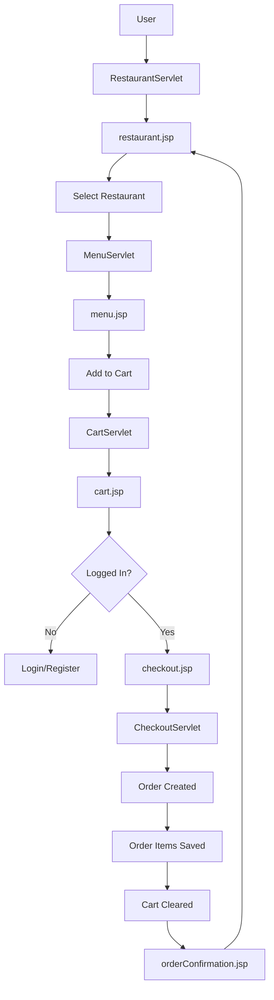

# 🍕 FoodieHub - Dynamic Food Delivery Web Application

FoodieHub is a full-stack, dynamic web application designed to connect users with their favorite local restaurants. Built using the MVC (Model-View-Controller) architecture, the application allows users to browse restaurants, view menus, manage a shopping cart, and place orders through a modern, responsive interface.

## 🚀 Features

* **User Management**: Secure Registration and Login system with session tracking.
* **Restaurant Browsing**: View a list of available restaurants with ratings, cuisine types, and delivery times.
* **Menu Exploration**: Dynamic menu loading based on the selected restaurant.
* **Persistent Shopping Cart**: Add, update, or remove items. The cart persists throughout the session.
* **Order Processing**: Seamless checkout flow involving address entry and payment method selection.
* **Order Confirmation**: Real-time database persistence for orders and individual order items.
* **Modern UI/UX**: Professional glassmorphic design using CSS gradients, animations, and responsive layouts.

## 🛠️ Tech Stack

* **Backend**: Java (Jakarta EE), Servlets
* **Frontend**: JSP (JavaServer Pages), HTML5, CSS3 (Modern Glassmorphism)
* **Database**: MySQL 8.0
* **Driver**: JDBC (MySQL Connector/J)
* **Server**: Apache Tomcat 10.1+ (Jakarta Namespace)
* **Project Type**: Dynamic Web Project

## 📁 Project Structure

```
FOOD_DELIVERY_APP
│
├── src
│   └── main
│       ├── java
│       │   └── com
│       │       ├── DAO
│       │       │   ├── MenuDAO.java
│       │       │   ├── OrderDAO.java
│       │       │   ├── OrderItemDAO.java
│       │       │   ├── RestaurantDAO.java
│       │       │   └── UserDAO.java
│       │       │
│       │       ├── DAOIMPLEMENTATION
│       │       │   ├── MenuDAOImplementation.java
│       │       │   ├── OrderDAOImplementation.java
│       │       │   ├── OrderItemDAOImplementation.java
│       │       │   ├── RestaurantDAOImplementation.java
│       │       │   └── UserDAOImplementation.java
│       │       │
│       │       ├── Model
│       │       │   ├── Cart.java
│       │       │   ├── CartItem.java
│       │       │   ├── Menu.java
│       │       │   ├── Order.java
│       │       │   ├── OrderItem.java
│       │       │   ├── Restaurant.java
│       │       │   └── User.java
│       │       │
│       │       └── Servlets
│       │           ├── CartServlet.java
│       │           ├── CheckoutServlet.java
│       │           ├── LoginServlet.java
│       │           ├── MenuServlet.java
│       │           ├── RegisterServlet.java
│       │           └── RestaurantServlet.java
│       │
│       └── webapp
│           ├── images
│           │   └── menu
│           │       ├── pizza.jpg
│           │       ├── burger.jpg
│           │       └── biryani.jpg
│           │
│           ├── META-INF
│           │
│           ├── WEB-INF
│           │   ├── lib
│           │   │   └── mysql-connector-j-9.1.0.jar
│           │   └── web.xml
│           │
│           ├── cart.jsp
│           ├── checkout.jsp
│           ├── login.html
│           ├── menu.jsp
│           ├── orderConfirmation.jsp
│           ├── register.html
│           ├── restaurant.jsp
│           ├── style.css
│           └── register.css
│
├── Libraries
├── JRE System Library [JavaSE-21]
├── Server Runtime [Apache Tomcat v10.1]
├── Web App Libraries
└── Referenced Libraries
    └── mysql-connector-j-9.1.0.jar


```

## 🗄️ Database Schema
The project uses a MySQL database named `courseproject`. The core tables are:
1. **users**: Stores user credentials and roles (customer, restaurant_admin, etc.).
2. **restaurant**: Contains restaurant details like name, cuisine, rating, and image paths.
3. **menu**: Stores food items linked to specific `restaurantId`.
4. **order**: Stores high-level order details (Total amount, status, user ID).
5. **orderitem**: Stores the breakdown of each item within an order (linked via `orderId`).

## 🔧 Setup & Installation
### Database Setup:
1. Create a database named `courseproject`.
2. Run the SQL scripts to create the tables: `users`, `restaurant`, `menu`, `order`, and `orderitem`.
3. Update the `DriverManager.getConnection()` strings in the DAO implementation classes with your MySQL root password.

### Environment Configuration:
1. Ensure you are using Java 17+.
2. Use a server that supports Jakarta EE (e.g., Apache Tomcat 10+).
3. Add the `mysql-connector-j-x.x.x.jar` to your project's build path or `WEB-INF/lib`.

### Deployment:
1. Clone the project into Eclipse or IntelliJ.
2. Right-click the project -> Run As -> Run on Server.
3. The app starts at `http://localhost:8080/food_delivery_app/`.

## 🚦 Application Workflow
1. **Home Page**: The user lands on the restaurant listing page (`restaurant.jsp`).
2. **Menu**: Clicking a restaurant redirects to `MenuServlet`, which fetches items for that specific ID.
3. **Cart**: Users add items to the cart. The `CartServlet` manages a `HashMap` stored in the `HttpSession`.
4. **Auth**: To checkout, users must log in via `LoginServlet`.
5. **Checkout**: Users provide a delivery address and payment method in `checkout.jsp`.
6. **Persistence**: `CheckoutServlet` saves the order to the `order` table, retrieves the generated `orderId`, and saves each item to the `orderitem` table.
7. **Success**: The user is redirected to the `orderConfirmation.jsp`.

## 🎨 UI Preview
* **Animations**: Subtle floating background animations and hover-scaling on cards.
* **Theme**: Dark mode interface with neon accents (`#ff6bcb`, `#43e97b`).
* **Responsiveness**: Fully functional on mobile, tablet, and desktop views.

## 🛡️ Security Features
* **Session Management**: Prevents unauthorized checkout without a valid user login.
* **Login Attempts**: Account blocking logic implemented in `LoginServlet` to prevent brute-force attacks (max 3 attempts).
* **Auto-Increment IDs**: JDBC `RETURN_GENERATED_KEYS` used to safely link Order items to the correct Order ID.

## 📝 Author
Developed as a Dynamic Web Project.
**Keywords:** Java, Servlets, JSP, JDBC, MySQL, Web Development.


---
# Project Work-Flow

# FoodieHub – Java JEE Food Delivery Web Application

FoodieHub is a Java JEE dynamic web application built using the MVC (Model–View–Controller) architecture.
It allows users to browse restaurants, view menus, manage a cart, register or log in, place orders, and persist data in a MySQL database.

---

## Tech Stack

- Java (JEE)
- JSP & Servlets
- JDBC
- MySQL
- Apache Tomcat
- HTML, CSS
- MVC Architecture

---

## Architecture Overview

### Model Layer

POJO classes represent database entities and map directly to tables in the `courseproject` database.

- User
- Restaurant
- Menu
- Order
- OrderItem
- Cart
- CartItem

Foreign key relationship example:
```
menu.restaurantId -> restaurant.restaurantid
```

Database connection:
```
jdbc:mysql://localhost:3306/courseproject
username: root
password: ******
```

DAO implementations use JDBC with PreparedStatements.

---

### Controller Layer

Servlets handle HTTP requests and application logic.

- RestaurantServlet
- MenuServlet
- CartServlet
- RegisterServlet
- LoginServlet
- CheckoutServlet

Servlet mapping example:
```
/restaurant
```

---

### View Layer

JSP pages render dynamic content with CSS styling.

- restaurant.jsp
- menu.jsp
- cart.jsp
- checkout.jsp
- orderConfirmation.jsp

---

## Application Startup Flow

The application is deployed on Apache Tomcat.

Welcome page:
```
restaurant.jsp
```

RestaurantServlet fetches restaurant data and forwards it to the view.
No login is required for browsing.

---

## User Registration and Login

### Registration

Form:
```
register.html
```

Request:
```
POST /register
```

User data is stored in the `users` table.

---

### Login

Form:
```
login.html
```

Request:
```
POST /Login
```

LoginServlet:
- Validates credentials
- Tracks failed attempts (max 3)
- Stores user in HttpSession

On success:
```
cart.jsp
```

---

## Browsing and Cart Management

Restaurant selection:
```
GET /menu?restaurantId=ID
```

Add to cart:
```
POST /cart
action=add
itemId
restaurantId
quantity
```

Cart stored in session as:
```
HashMap<Integer, CartItem>
```

CartServlet:
- Add item
- Update quantity
- Remove item
- Calculate total
- Restrict multiple restaurants

---

## Checkout and Order Placement

Proceed from cart to checkout.

Request:
```
POST /checkout
```

CheckoutServlet:
- Validates user and cart
- Creates Order
- Inserts OrderItems
- Clears cart session

Order status:
```
pending
```

---

## Database Tables

- users
- restaurant
- menu
- order
- orderitem

Image storage:
```
/images/restaurants/rest1.jpg
```

---

## Application Flow Diagram



---

## Notes

- JDBC via DriverManager (no connection pooling)
- Session-based authentication and cart
- Clean MVC separation
- Academic project ready

